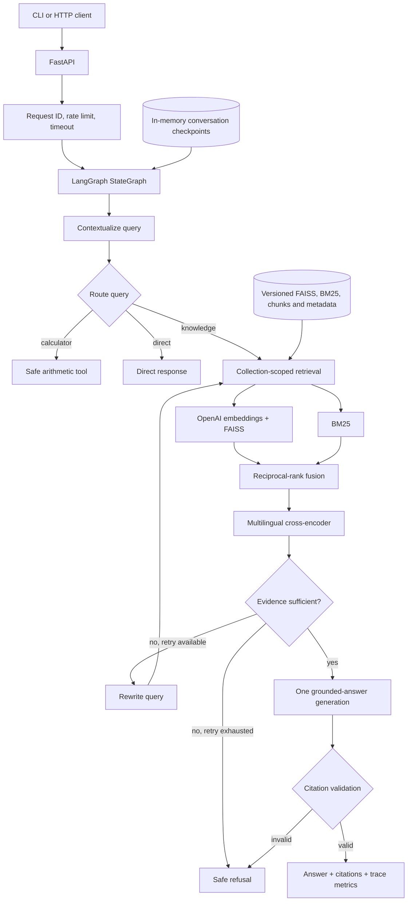

# Architecture

## System boundary

This project is a single-agent enterprise knowledge-base RAG service. It uses
an explicit LangGraph workflow to make routing, retrieval, recovery and citation
validation observable and testable. It is deliberately not a multi-agent or
microservice system.



## Request lifecycle

1. FastAPI validates the request and assigns or preserves `X-Request-ID`.
2. The process-local limiter and request timeout guard non-probe routes.
3. A session lock serializes requests sharing the same `session_id`; different
   sessions can progress concurrently.
4. The LangGraph workflow contextualizes follow-up questions, then routes to
   knowledge retrieval, deterministic calculation or a direct response.
5. Knowledge retrieval is restricted to the requested collection and optional
   exact metadata filters.
6. Dense and lexical candidate lists are fused with RRF. The configured
   cross-encoder reranks only the candidate pool and is loaded lazily once.
7. Evidence is graded. Insufficient evidence receives at most one query rewrite
   and retry under the default configuration.
8. Grounded answer generation runs once after evidence is accepted. Returned
   `source`, `page` and `chunk_id` values must match the request evidence;
   otherwise the graph fails closed.
9. The response contains the answer, validated citations and trace metrics.

The graph has ten named nodes and a default 12-step recursion limit. Those
bounds prevent an evidence-recovery loop from running indefinitely.

## Retrieval pipeline

The default `hybrid_rerank` mode combines:

- normalized OpenAI embeddings searched by FAISS `IndexFlatIP`;
- a local BM25 index with deterministic English word and Chinese character
  tokenization;
- reciprocal-rank fusion with `1 / (rrf_k + rank)` contributions;
- `cross-encoder/mmarco-mMiniLMv2-L12-H384-v1` reranking.

`dense`, `bm25`, `hybrid` and `hybrid_rerank` remain selectable so the same
corpus, labels and metrics can be used for ablation testing.

## Knowledge-base lifecycle

Each collection owns its document registry and immutable index versions:

```text
data/indexes/<collection_id>/
├── collection.json
├── documents.json
├── documents/<document_id>.pdf
├── CURRENT
└── versions/<version_id>/
    ├── faiss.index
    ├── bm25.json
    ├── chunks.json
    └── manifest.json
```

Uploads and deletions build a complete replacement version before atomically
changing `CURRENT`. A failed rebuild leaves the previously active version
readable. Documents and indexes survive process and container replacement; the
Compose deployment stores them in `agent-rag_knowledge_indexes`.

The v1 loader accepts text-based PDFs up to 25 MB. Scanned PDFs require OCR and
are rejected explicitly.

## API surface

| Method | Path | Purpose |
|---|---|---|
| `GET` | `/health` | Process liveness |
| `GET` | `/ready` | Workflow and active-index readiness |
| `POST` | `/ask` | Run the bounded agent workflow |
| `DELETE` | `/sessions/{session_id}` | Clear a conversation checkpoint |
| `POST/GET` | `/collections` | Create or list collections |
| `POST/GET` | `/collections/{id}/documents` | Upload or list documents |
| `GET/DELETE` | `/collections/{id}/documents/{document_id}` | Inspect or delete a document |
| `POST` | `/collections/{id}/rebuild` | Rebuild and atomically activate indexes |

Failures use a stable envelope with `code`, `message`, `request_id` and
`retryable`. The taxonomy covers validation, not-found, conflict, rate-limit,
timeout, dependency, readiness and internal failures.

## Observability and deployment

Application logs are JSON and correlate request completion and agent completion
events by request ID. `/ask` traces workflow and retrieval latency, aggregate
input/output tokens, retry count, route and node count. Cost estimation is only
populated when model-specific per-million input/output rates are configured.

CI runs Ruff, mypy and pytest on Python 3.12 and builds the Docker image. The
runtime image installs CPU-only PyTorch. Compose runs one Uvicorn worker because
conversation checkpoints, session locks and rate-limit counters are currently
in process memory.

## Trust boundaries and non-goals

- Collection scope is supplied by the caller, but authentication and
  authorization are not implemented. This is not a tenant-security boundary.
- Conversation checkpoints do not survive restart; document indexes do.
- Rate limiting is per process, not distributed.
- Citation validation checks reference integrity against retrieved evidence; it
  does not independently prove every natural-language claim.
- OCR, distributed queues, Kubernetes, a graph database and multi-agent
  orchestration are intentionally outside the v1 scope.

